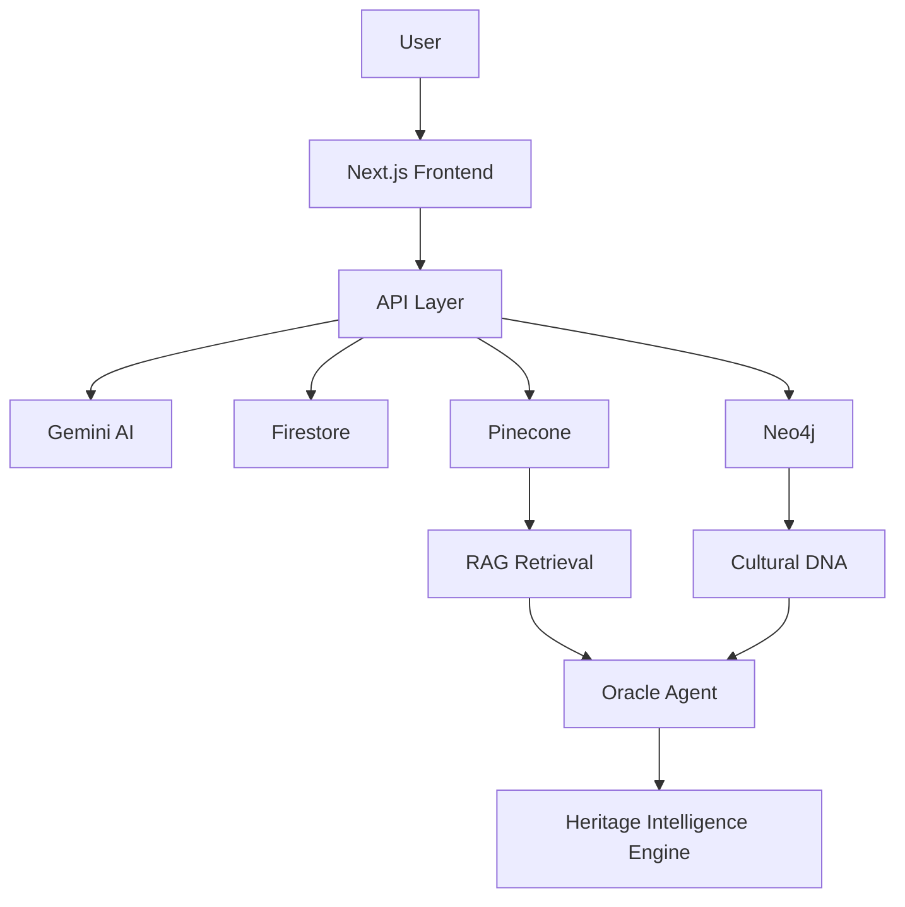
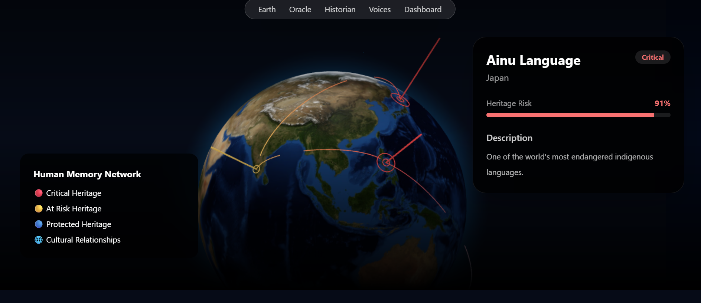
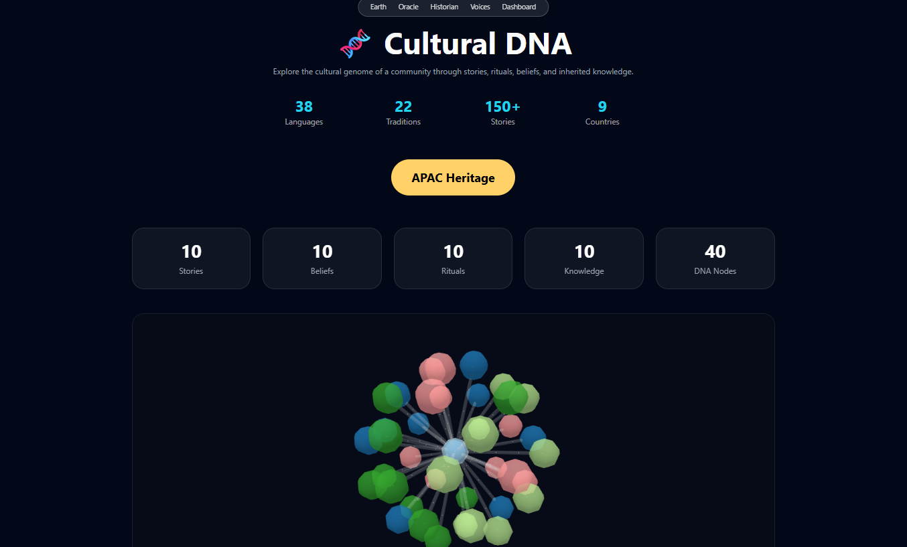
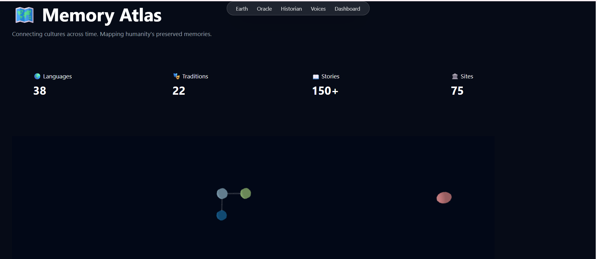

# 🌌 Echoes of the Unseen

## What Humanity Forgets, We Remember.

### Live Demo

🚀 [View Demo](https://echoes-of-the-unseen.vercel.app/)

---

## Overview

Every day, humanity loses pieces of its memory.

Languages disappear.

Traditions fade.

Websites vanish.

Communities dissolve.

Stories die with elders.

Most AI systems focus on creating more content.

**Echoes of the Unseen** asks a different question:

> What happens when humanity forgets?

Echoes of the Unseen is an AI-powered Heritage Intelligence Platform that discovers, predicts, preserves, and visualizes endangered cultures, traditions, oral histories, communities, and digital artifacts before they disappear forever.

Built for:

**Meet the Builders — The Gen AI Academy APAC**

---

# ✨ Key Features

- 🌍 Vanishing Earth – Interactive endangered heritage globe
- 🔮 Echo Oracle – AI-powered cultural intelligence assistant
- 🕰 Future Historian – Predict future historical significance
- 🎙 Last Voices – Preserve oral histories and elder wisdom
- 🧬 Cultural DNA – Knowledge graph of cultural relationships
- 🌌 Memory Atlas – Interactive heritage network visualization
- 🏺 Digital Fossils – Archive disappearing digital communities
- 📚 Heritage Book Generator – One-click preservation reports
- ⏳ Time Capsule – Future memory preservation

---

# ✨ Core Features

### 🌍 Vanishing Earth
Interactive globe showing endangered cultures, languages, and traditions.

### 🔮 Echo Oracle
AI-powered heritage intelligence assistant.

### 🕰 Future Historian
Predicts future historical significance of memories and artifacts.

### 🎙 Last Voices
Preserves oral histories and extracts cultural wisdom.

### 🧬 Cultural DNA
Visualizes relationships between stories, rituals, beliefs, and knowledge.

### 🌌 Memory Atlas
Interactive network of cultural connections and preserved memories.

---

# 🚀 Innovation Highlights

- AI for cultural preservation rather than content generation
- Heritage risk prediction engine
- Multi-agent preservation architecture
- Interactive cultural knowledge graph
- Future historical significance analysis
- Human memory mapping through network intelligence
- Preservation-first AI design philosophy

---

# ❗ Problem Statement

According to UNESCO, languages, traditions, oral histories, and indigenous knowledge systems disappear every year.

Many cultural assets exist only in the memories of elders, small communities, and fragile digital archives.

Current AI systems generate content but rarely help preserve human memory.

Echoes of the Unseen was built to address this gap.

---

# 🏆 Why This Matters

Humanity doesn't lose its memory all at once.

It disappears one story at a time.

Echoes of the Unseen acts as an AI Guardian of Human Memory.

---

# 🧠 AI Architecture

## Multi-Agent System

### Discovery Agent

Identifies culturally significant artifacts.

### Future Historian Agent

Predicts future historical importance.

### Oracle Agent

Detects overlooked cultural knowledge.

### Risk Prediction Agent

Calculates extinction risk and preservation urgency.

### Preservation Agent

Creates structured archives.

### Storytelling Agent

Transforms heritage into narratives.

---

# ⚙️ Technology Stack

## Frontend

- Next.js 15
- TypeScript
- Tailwind CSS
- Framer Motion

## AI

- Gemini 2.5 Flash
- Gemini Embeddings

## Knowledge Layer

- Pinecone Vector Database
- Neo4j Knowledge Graph

## Backend

- Next.js API Routes

## Storage

- Firebase Firestore

## Deployment

- Vercel

---

# 🛣️ Roadmap

### Phase 1
- AI heritage discovery
- Cultural DNA visualization
- Oracle intelligence engine

### Phase 2
- Real-time UNESCO heritage integration
- Community preservation submissions
- Mobile application

### Phase 3
- Global Memory Vault
- Multilingual preservation engine
- Cultural extinction early-warning system

### Phase 4
- Open Heritage API
- Research partnerships
- Global cultural preservation network

---

# 🌐 System Architecture



---

# 🔍 Core AI Pipeline

```text
User Question
      ↓
Gemini Embedding
      ↓
Pinecone Search
      ↓
Heritage Context
      ↓
Oracle Agent
      ↓
Gemini Reasoning
      ↓
Preservation Insights
```

---

# 🧬 Cultural DNA Pipeline

```text
Culture
    ↓
Stories
Beliefs
Rituals
Knowledge
    ↓
Neo4j Graph
    ↓
Interactive Visualization
```

---

# 📂 Repository Structure

```text
echoes-of-the-unseen/

src/
├── app/
├── components/
├── agents/
├── services/
├── hooks/
├── data/
├── utils/
├── styles/
└── constants/

public/
docs/
scripts/
tests/
deployment/
```

---

# 🚀 Local Development

Clone repository:

```bash
git clone https://github.com/SaiMeghana14/echoes-of-the-unseen.git
```

Install dependencies:

```bash
npm install
```

Create:

```env
.env.local
```

Add:

```env
GEMINI_API_KEY=

PINECONE_API_KEY=
PINECONE_INDEX=

NEO4J_URI=
NEO4J_USER=
NEO4J_PASSWORD=

NEXT_PUBLIC_FIREBASE_API_KEY=
NEXT_PUBLIC_FIREBASE_AUTH_DOMAIN=
NEXT_PUBLIC_FIREBASE_PROJECT_ID=
NEXT_PUBLIC_FIREBASE_STORAGE_BUCKET=
NEXT_PUBLIC_FIREBASE_MESSAGING_SENDER_ID=
NEXT_PUBLIC_FIREBASE_APP_ID=
```

Run:

```bash
npm run dev
```

---

# 📊 APAC Impact

Echoes of the Unseen focuses on:

- Indigenous Languages
- Oral Histories
- Folk Medicine
- Community Storytelling
- Regional Crafts
- Traditional Knowledge Systems

across:

- India
- Indonesia
- Philippines
- Japan
- Vietnam
- Thailand
- New Zealand
- APAC Regions

---

# 🌍 Vision

We believe cultural extinction is one of the world's most overlooked challenges.

Our goal is to build the world's first AI-powered Heritage Intelligence Platform that can identify, preserve, and protect humanity's collective memory before it disappears.

---

# 📸 Screenshots

| 🌍 Vanishing Earth |
|-------------------|
|  |

| 🧬 Cultural DNA |
|----------------|
|  |

| 🌌 Memory Atlas |
|----------------|
|  |

---

# 👩‍💻 Author

**K.N.V Sai Meghana**

B.Tech Electronics & Communication Engineering

GitHub:
https://github.com/SaiMeghana14

LinkedIn:
https://www.linkedin.com/in/naga-venkata-sai-meghana-kovvada131b51259

---

# ❤️ Final Thought

> Humanity doesn't lose its memory all at once.
>
> It disappears one story at a time.
>
> ## Echoes of the Unseen ensures those stories are never lost.
