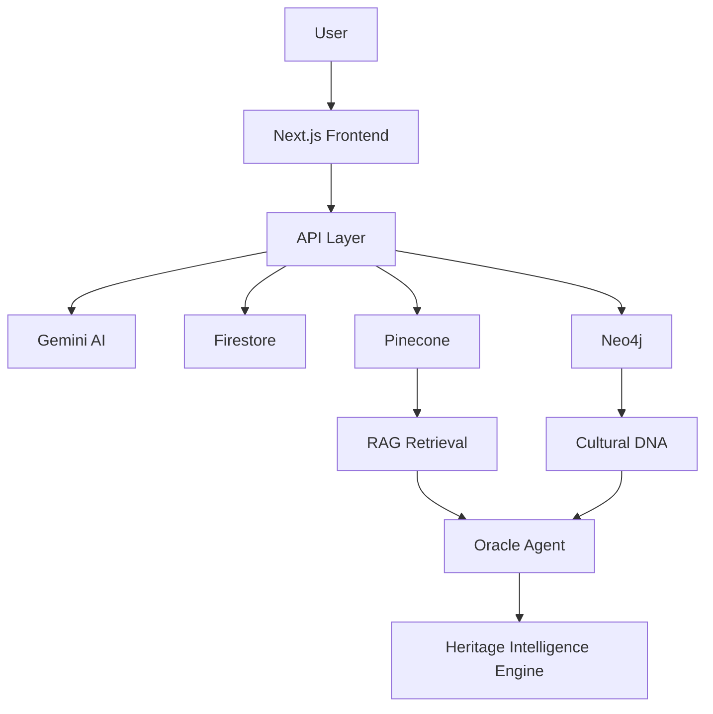

# 🌌 Echoes of the Unseen

## What Humanity Forgets, We Remember.

### Live Demo

🚀 https://your-vercel-url.vercel.app

---

## Overview

Every day, humanity loses pieces of its memory.

Languages disappear.

Traditions fade.

Websites vanish.

Communities dissolve.

Stories die with elders.

Most AI systems focus on creating more content.

**Echoes of the Unseen** asks a different question:

> What happens when humanity forgets?

Echoes of the Unseen is an AI-powered Heritage Intelligence Platform that discovers, predicts, preserves, and visualizes endangered cultures, traditions, oral histories, communities, and digital artifacts before they disappear forever.

Built for:

**Meet the Builders — The Gen AI Academy APAC**

---

# 🎥 Demo Experience

## 🌍 Vanishing Earth

A living globe of human memory.

Every pulse represents something at risk:

- Endangered languages
- Disappearing traditions
- Oral histories
- Indigenous knowledge
- Cultural practices

Users explore a dynamic map of cultural preservation needs across APAC.

---

## 🔮 Echo Oracle

Ask:

> What is humanity forgetting right now?

The Oracle combines:

- Gemini AI
- Vector Search
- Heritage Intelligence
- Cultural Risk Prediction

to identify hidden cultural treasures and emerging preservation priorities.

---

## 🕰 Future Historian

Upload:

- Story
- Recipe
- Tradition
- Photograph
- Website
- Cultural Artifact

AI responds:

> A historian in 2126 would consider this significant because...

This feature transforms ordinary memories into future historical narratives.

---

## 🎙 Last Voices

Preserve wisdom before it disappears.

Upload elder interviews or transcripts.

AI extracts:

- Stories
- Traditions
- Beliefs
- Cultural Practices
- Life Lessons

and creates searchable heritage archives.

---

## 🧬 Cultural DNA

Every culture contains:

- Stories
- Rituals
- Symbols
- Beliefs
- Knowledge

Cultural DNA visualizes these relationships using a dynamic Neo4j knowledge graph.

---

## 🌌 Memory Constellation

Memories become stars.

Stories become galaxies.

Cultural relationships become constellations.

Users explore a living universe of human knowledge.

---

## 🏺 Digital Fossils

Analyze:

- Websites
- Blogs
- Forums
- Online Communities

before they disappear forever.

The system evaluates:

- Historical Significance
- Cultural Value
- Community Impact
- Future Relevance

---

## 📚 Heritage Book Generator

Generate a complete preservation archive:

- Timeline
- Historical Summary
- Stories
- Cultural Significance
- Preservation Recommendations

with a single click.

---

## ⏳ Time Capsule

Create future memory archives.

Store cultural knowledge and artifacts that can be revisited years later.

---

# 🏆 Why This Matters

Humanity doesn't lose its memory all at once.

It disappears one story at a time.

Echoes of the Unseen acts as an AI Guardian of Human Memory.

---

# 🧠 AI Architecture

## Multi-Agent System

### Discovery Agent

Identifies culturally significant artifacts.

### Future Historian Agent

Predicts future historical importance.

### Oracle Agent

Detects overlooked cultural knowledge.

### Risk Prediction Agent

Calculates extinction risk and preservation urgency.

### Preservation Agent

Creates structured archives.

### Storytelling Agent

Transforms heritage into narratives.

---

# ⚙️ Technology Stack

## Frontend

- Next.js 15
- TypeScript
- Tailwind CSS
- Framer Motion

## AI

- Gemini 2.5 Flash
- Gemini Embeddings

## Knowledge Layer

- Pinecone Vector Database
- Neo4j Knowledge Graph

## Backend

- Next.js API Routes

## Storage

- Firebase Firestore

## Deployment

- Vercel

---

# 🌐 System Architecture



---

# 🔍 Core AI Pipeline

```text
User Question
      ↓
Gemini Embedding
      ↓
Pinecone Search
      ↓
Heritage Context
      ↓
Oracle Agent
      ↓
Gemini Reasoning
      ↓
Preservation Insights
```

---

# 🧬 Cultural DNA Pipeline

```text
Culture
    ↓
Stories
Beliefs
Rituals
Knowledge
    ↓
Neo4j Graph
    ↓
Interactive Visualization
```

---

# 📂 Repository Structure

```text
echoes-of-the-unseen/

src/
├── app/
├── components/
├── agents/
├── services/
├── hooks/
├── data/
├── utils/
├── styles/
└── constants/

public/
docs/
scripts/
tests/
deployment/
```

---

# 🚀 Local Development

Clone repository:

```bash
git clone https://github.com/SaiMeghana14/echoes-of-the-unseen.git
```

Install dependencies:

```bash
npm install
```

Create:

```env
.env.local
```

Add:

```env
GEMINI_API_KEY=

PINECONE_API_KEY=
PINECONE_INDEX=

NEO4J_URI=
NEO4J_USER=
NEO4J_PASSWORD=

NEXT_PUBLIC_FIREBASE_API_KEY=
NEXT_PUBLIC_FIREBASE_AUTH_DOMAIN=
NEXT_PUBLIC_FIREBASE_PROJECT_ID=
NEXT_PUBLIC_FIREBASE_STORAGE_BUCKET=
NEXT_PUBLIC_FIREBASE_MESSAGING_SENDER_ID=
NEXT_PUBLIC_FIREBASE_APP_ID=
```

Run:

```bash
npm run dev
```

---

# 📊 APAC Impact

Echoes of the Unseen focuses on:

- Indigenous Languages
- Oral Histories
- Folk Medicine
- Community Storytelling
- Regional Crafts
- Traditional Knowledge Systems

across:

- India
- Indonesia
- Philippines
- Japan
- Vietnam
- Thailand
- New Zealand
- APAC Regions

---

# 🌍 Vision

We believe cultural extinction is one of the world's most overlooked challenges.

Our goal is to build the world's first AI-powered Heritage Intelligence Platform that can identify, preserve, and protect humanity's collective memory before it disappears.

---

# 📸 Screenshots

Add screenshots here after deployment:

- Homepage
- Vanishing Earth
- Echo Oracle
- Future Historian
- Cultural DNA
- Memory Constellation
- Dashboard

---

# 👩‍💻 Author

**K.N.V Sai Meghana**

B.Tech Electronics & Communication Engineering

GitHub:
https://github.com/SaiMeghana14

LinkedIn:
https://www.linkedin.com/in/naga-venkata-sai-meghana-kovvada131b51259

---

# ❤️ Final Thought

> Humanity doesn't lose its memory all at once.
>
> It disappears one story at a time.
>
> ## Echoes of the Unseen ensures those stories are never lost.
